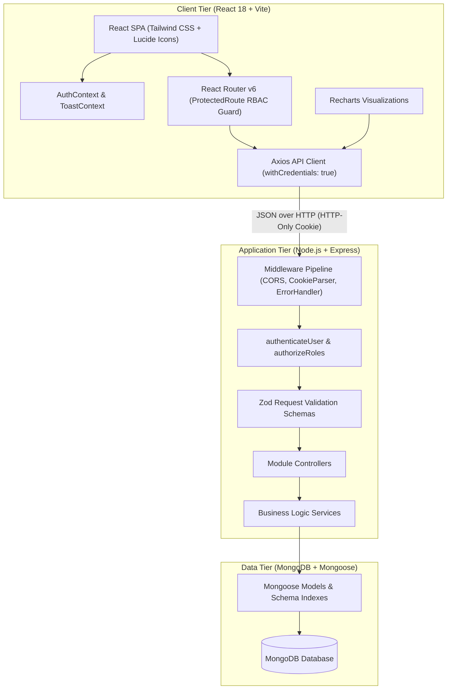
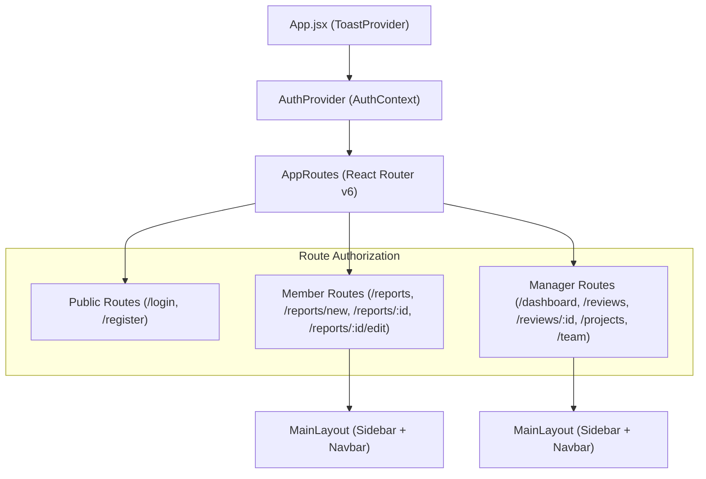

# System Architecture & Technical Design

This document details the architecture, design choices, component layering, and security boundaries for the **TeamPulse — Weekly Team Reporting & Performance Dashboard** built for Sisenco Digital.

---

## 1. High-Level Architecture

The system follows a decoupled, production-ready **3-Tier MERN Architecture**:



---

## 2. Backend Layering & Separation of Concerns

```text
HTTP Request
     │
     ▼
[ Express Router ] ──────► Matches route path & HTTP verb
     │
     ▼
[ AuthenticateUser ] ───► Verifies JWT in cookie, confirms active user status
     │
     ▼
[ AuthorizeRoles ] ────► Validates role (TEAM_MEMBER or MANAGER_ADMIN)
     │
     ▼
[ Zod Validate ] ──────► Validates request payload against strict schema
     │
     ▼
[ Controller ] ────────► Parses req.params / query, invokes service, formats ApiResponse
     │
     ▼
[ Service Layer ] ─────► Executes business logic, state transitions, version snapshots
     │
     ▼
[ Mongoose Models ] ───► Enforces DB schema, unique indexes, and document constraints
     │
     ▼
[ MongoDB DB ] ────────► Persistent document storage
```

### Module Responsibilities:
1. **`auth`**: User registration, login, logout, session verification via HTTP-only cookie.
2. **`projects`**: Project lifecycle, category queries, and team member assignments.
3. **`reports`**: Report draft creation, editing, status transitions, version snapshots, and ownership filtering.
4. **`reviews`**: Pending report inbox queries, report approvals, and mandatory-feedback correction requests.
5. **`users`**: Team member directory, user profile queries, account deactivation/reactivation.
6. **`dashboard`**: Real-time statistics aggregation, weekly submission velocity trend calculations, and member performance summary.

---

## 3. Frontend Architecture & State Management



### Key Frontend Patterns:
- **`ProtectedRoute`**: Reusable component that inspects `isAuthenticated`, `loading`, and `allowedRoles`. Redirects unauthenticated users to `/login` and unauthorized roles to `/unauthorized`.
- **`AuthContext`**: Centralized authentication state with automatic session bootstrap via `/api/auth/me`.
- **`ToastContext`**: Global notification toast queue with support for success, error, info, and warning states.
- **`api.js`**: Centralized Axios instance with `withCredentials: true` and uniform response/error interceptor unwrapping.

---

## 4. Security Architecture

1. **HTTP-Only Cookies**: JWT authentication tokens are never stored in JavaScript storage (`localStorage` or `sessionStorage`), effectively mitigating token theft via Cross-Site Scripting (XSS).
2. **Strict RBAC**: Enforces two roles: `TEAM_MEMBER` and `MANAGER_ADMIN`. Zero fallback to default admin permissions.
3. **Ownership Isolation (Anti-IDOR)**: Team members can only access and modify their own reports.
4. **Self-Deactivation Guard**: Prevents managers from accidentally deactivating their own accounts.
5. **Password Encryption**: Stored as salted bcrypt hashes with `select: false` on queries.
