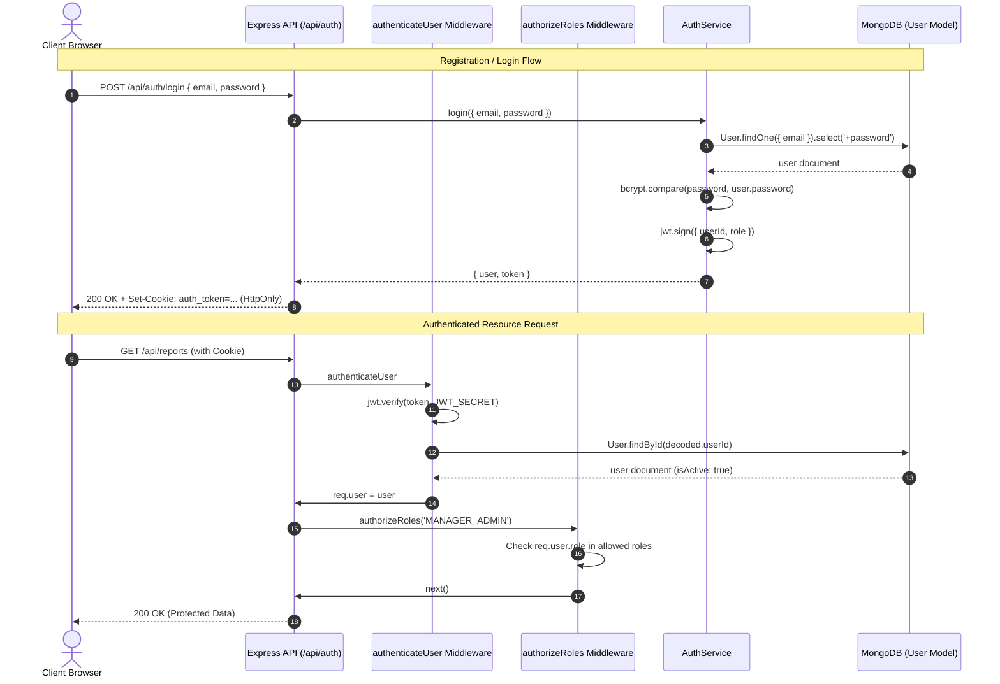

# Authentication, JWT Sessions, and Role-Based Access Control (RBAC)

This document provides a comprehensive specification of the authentication, session management, and role-based access control architecture for the **Weekly Report Generator & Team Dashboard** (Sisenco Digital Technical Assignment).

---

## 1. Authentication Architecture Overview

The authentication architecture is designed around stateless JSON Web Tokens (JWT) transported via **secure, HTTP-only cookies**. This approach prevents Cross-Site Scripting (XSS) token extraction while leveraging Mongoose and Express middleware for robust, database-backed role authorization.

### High-Level Authentication & Authorization Flow



---

## 2. JWT Strategy

- **Algorithm**: HMAC-SHA256 (`HS256`).
- **Secret**: Loaded strictly from `JWT_SECRET` in environment variables.
- **Expiration**: Configurable via `JWT_EXPIRES_IN` (default: `1d`).
- **Payload Contents**:
  ```json
  {
    "userId": "67d14cb8e854b41b9487c123",
    "role": "TEAM_MEMBER",
    "iat": 1789134000,
    "exp": 1789220400
  }
  ```
> [!IMPORTANT]
> The JWT payload contains **only minimal identity markers** (`userId`, `role`). Sensitive data (passwords, password hashes, email addresses) is **never** placed in the JWT.

---

## 3. Cookie & Session Strategy

- **Cookie Name**: `auth_token` (configurable via `COOKIE_NAME`).
- **`httpOnly: true`**: JavaScript running in the browser cannot access the cookie via `document.cookie`, mitigating XSS token theft.
- **`secure: process.env.NODE_ENV === 'production'`**: Transmitted strictly over TLS/HTTPS in production while allowing local HTTP development.
- **`sameSite: 'lax'`**: Provides protection against Cross-Site Request Forgery (CSRF).
- **`maxAge`**: Set to 24 hours (86,400,000 ms), matching token expiration.
- **No LocalStorage/SessionStorage Token Storage**: Eliminates client-side credential leakage.

---

## 4. Password Hashing & Security

- **Library**: `bcryptjs`.
- **Salt Factor**: 10 salt rounds.
- **Database Schema**: The `password` field in `User.js` is configured with `select: false`. Normal queries (e.g. `User.find()`) omit the password hash.
- **Explicit Password Selection**: Only authentication services explicitly request the password field via `.select('+password')`.
- **Response Sanitization**: Serializers (`formatSafeUser`) and schema `toJSON`/`toObject` transform hooks delete the `password` field before serialization.

---

## 5. Registration Flow (`POST /api/auth/register`)

1. User submits `name`, `email`, `password`.
2. Input is validated via Zod schema (`registerSchema`).
3. Email is normalized (lowercased and trimmed).
4. System checks for existing account; returns `409 Conflict` if duplicate.
5. Password is hashed with `bcrypt.hash(password, 10)`.
6. User record is created with **strictly forced role `TEAM_MEMBER`**.
7. Signed JWT is generated and attached as an HTTP-only cookie.
8. Sanitized user profile is returned (`201 Created`).

---

## 6. Login Flow (`POST /api/auth/login`)

1. User submits `email` and `password`.
2. Input is validated via Zod schema (`loginSchema`).
3. Database is queried for `User.findOne({ email }).select('+password')`.
4. If user not found OR `bcrypt.compare` fails, returns a **generic error** (`401 Unauthorized: "Invalid email or password"`).
5. If `user.isActive === false`, returns `401 Unauthorized: "Account has been deactivated"`.
6. Signed JWT is generated and attached as an HTTP-only cookie.
7. Sanitized user profile is returned (`200 OK`).

---

## 7. Logout Flow (`POST /api/auth/logout`)

1. Express clears the `auth_token` cookie via `res.clearCookie`.
2. Returns `200 OK: "Logged out successfully"`.
3. Safe and idempotent (calling while unauthenticated does not error).

---

## 8. Current User Verification (`GET /api/auth/me`)

1. Middleware `authenticateUser` verifies token and loads user from MongoDB.
2. Returns active user data (`id`, `name`, `email`, `role`, `avatar`, `isActive`, `createdAt`, `updatedAt`).
3. If an account is deactivated after token issuance, subsequent requests fail immediately with `401`.

---

## 9. Middleware Pipeline

### 9.1 `authenticateUser.js`
1. Reads token from HTTP-only cookie (`req.cookies.auth_token`) or `Authorization: Bearer` header.
2. Verifies token with `jwt.verify(token, config.jwtSecret)`.
3. Queries `User.findById(decoded.userId)`.
4. Verifies `user.isActive === true`.
5. Attaches sanitized document to `req.user`.

### 9.2 `authorizeRoles.js`
1. Takes allowed roles (e.g. `authorizeRoles('MANAGER_ADMIN')`).
2. Validates that requested role is within system roles (`['TEAM_MEMBER', 'MANAGER_ADMIN']`).
3. Verifies `req.user` exists.
4. Checks `req.user.role` from the database.
5. If unauthorized, returns `403 Forbidden`.

---

## 10. Role-Based Access Control (RBAC) Architecture

### 10.1 Two-Role Specification

The application strictly implements **two application roles**:

| Role | Description & Scope |
| :--- | :--- |
| **`TEAM_MEMBER`** | Standard team member responsible for creating, editing, and submitting their own weekly progress reports and viewing personal submission history. |
| **`MANAGER_ADMIN`** | Combined leadership and administration role responsible for reviewing submitted reports, requesting corrections, approving reports, accessing team dashboard analytics, and managing projects/categories. |

---

## 11. Why `MANAGER_ADMIN` Exists & Why `ADMIN` / `MANAGER` Are Invalid

- **Assignment Alignment**: The Sisenco Digital technical assignment specifies a flat dual-tier operational model (Team Members and Manager/Admins).
- **Separation Elimination**: Creating separate `MANAGER` and `ADMIN` roles introduces unnecessary complexity and permission fragmentation when both responsibilities are handled by team leads and project administrators.
- **Strict Role Enforcement**: Any attempt to register or authorize `ADMIN` or `MANAGER` is explicitly rejected.

---

## 12. Detailed API Endpoint Specifications

### 1. Register User
- **Method**: `POST`
- **URL**: `/api/auth/register`
- **Auth Required**: No (Public)
- **Request Body**:
  ```json
  {
    "name": "Alex Smith",
    "email": "alex@example.com",
    "password": "Password123!"
  }
  ```
- **Success Response (`201 Created`)**:
  ```json
  {
    "success": true,
    "message": "Registration successful",
    "data": {
      "id": "6aa4041ad7b0b7a75ee6c268",
      "name": "Alex Smith",
      "email": "alex@example.com",
      "role": "TEAM_MEMBER",
      "avatar": null,
      "isActive": true,
      "createdAt": "2026-09-11T13:00:00.000Z",
      "updatedAt": "2026-09-11T13:00:00.000Z"
    }
  }
  ```
- **Error Responses**:
  - `400 Bad Request`: Validation failure (short name, invalid email, weak password).
  - `409 Conflict`: Email already registered.

---

### 2. Login User
- **Method**: `POST`
- **URL**: `/api/auth/login`
- **Auth Required**: No (Public)
- **Request Body**:
  ```json
  {
    "email": "alex@example.com",
    "password": "Password123!"
  }
  ```
- **Success Response (`200 OK`)**:
  ```json
  {
    "success": true,
    "message": "Login successful",
    "data": {
      "id": "6aa4041ad7b0b7a75ee6c268",
      "name": "Alex Smith",
      "email": "alex@example.com",
      "role": "TEAM_MEMBER",
      "avatar": null,
      "isActive": true,
      "createdAt": "2026-09-11T13:00:00.000Z",
      "updatedAt": "2026-09-11T13:00:00.000Z"
    }
  }
  ```
- **Error Responses**:
  - `401 Unauthorized`: `"Invalid email or password"` or `"Account has been deactivated"`.

---

### 3. Current User
- **Method**: `GET`
- **URL**: `/api/auth/me`
- **Auth Required**: Yes (`authenticateUser`)
- **Success Response (`200 OK`)**:
  ```json
  {
    "success": true,
    "message": "User profile retrieved successfully",
    "data": {
      "id": "6aa4041ad7b0b7a75ee6c268",
      "name": "Alex Smith",
      "email": "alex@example.com",
      "role": "TEAM_MEMBER",
      "avatar": null,
      "isActive": true,
      "createdAt": "2026-09-11T13:00:00.000Z",
      "updatedAt": "2026-09-11T13:00:00.000Z"
    }
  }
  ```
- **Error Responses**:
  - `401 Unauthorized`: Missing or invalid session cookie.

---

### 4. Logout User
- **Method**: `POST`
- **URL**: `/api/auth/logout`
- **Auth Required**: No (Safe & Idempotent)
- **Success Response (`200 OK`)**:
  ```json
  {
    "success": true,
    "message": "Logged out successfully",
    "data": null
  }
  ```

---

## 13. Frontend Authentication Approach

- **Axios Configuration**: Configured with `withCredentials: true` in [`frontend/src/services/api.js`](file:///d:/Sisenco%20Assignment/frontend/src/services/api.js) so cookies are automatically sent with all requests.
- **`AuthContext` & `useAuth`**: Provides application-level state (`user`, `loading`, `isAuthenticated`, `isManagerAdmin`, `isTeamMember`, `login`, `register`, `logout`).
- **Session Restoration**: On initial load, `AuthContext` calls `GET /api/auth/me` to check for an active cookie without any token stored in `localStorage` or `sessionStorage`.

---

## 14. Environment Variables

| Variable | Description | Example / Default |
| :--- | :--- | :--- |
| `PORT` | Backend HTTP Port | `5000` |
| `NODE_ENV` | Runtime environment (`development` / `production`) | `development` |
| `MONGODB_URI` | MongoDB Connection String | `mongodb://localhost:27017/team_report_dashboard` |
| `CORS_ORIGIN` | Allowed CORS Origins | `http://localhost:5173` |
| `JWT_SECRET` | Secret key for JWT signing | Strong random string in `.env` |
| `JWT_EXPIRES_IN`| Token lifespan | `1d` |
| `COOKIE_NAME` | Session cookie identifier | `auth_token` |

---

## 15. Testing Strategy

Automated Jest & Supertest integration tests in `backend/tests/auth.test.js` verify:
- Registration, password hashing, and role coercion to `TEAM_MEMBER`
- Privilege escalation rejection
- Login authentication, HTTP-only cookie setting, and generic error verification
- Session retrieval via `/me` and cookie clearance on `/logout`
- Role-based authorization on protected endpoints (`/test-member`, `/test-manager-admin`)
- Rejection of invalid roles (`ADMIN`, `MANAGER`)
