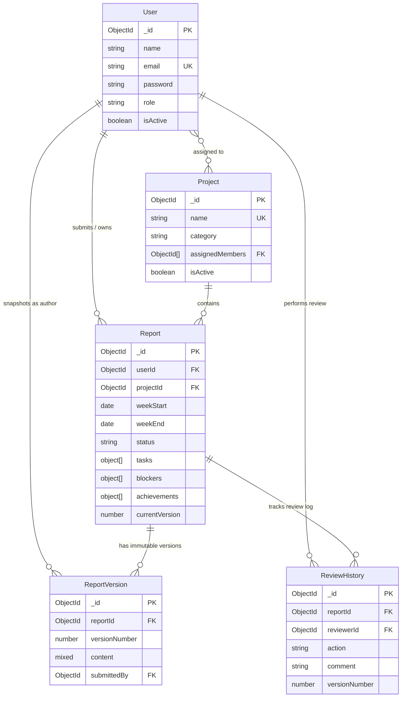
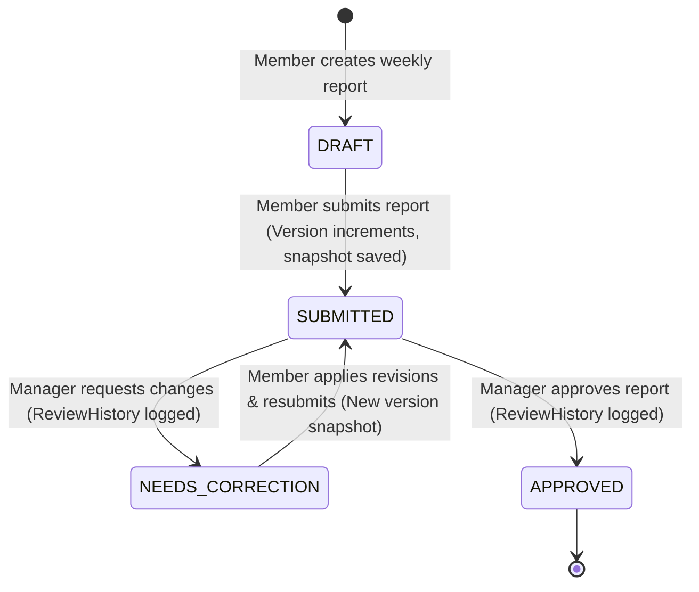

# Database Design & Data Modeling Specification

This document details the complete MongoDB / Mongoose schema design, indexing strategies, relationships, and lifecycle principles for the **Weekly Report Generator & Team Dashboard** (Sisenco Digital Technical Assignment).

---

## 1. Overview

The database architecture is built using **Mongoose ODM** on top of **MongoDB**. It uses normalized document references (`ObjectId`) for entity relationships while embedding closely-coupled data structures (such as tasks, blockers, achievements, and hours breakdown) directly inside the parent `Report` document.

### Core Entity Summary
- **`User`**: Team members and managers/administrators (`TEAM_MEMBER`, `MANAGER_ADMIN`).
- **`Project`**: Active and archived projects containing assigned members.
- **`Report`**: Weekly status submissions containing work breakdown, blockers, achievements, and review status.
- **`ReportVersion`**: Immutable historical point-in-time snapshots created at submission.
- **`ReviewHistory`**: Complete audit trail of manager reviews and feedback actions.

---

## 2. User Model (`models/User.js`)

Stores user accounts, credentials, and role-based access control levels.

```javascript
{
  name: { type: String, required: true, trim: true, maxlength: 100 },
  email: { type: String, required: true, unique: true, lowercase: true, trim: true },
  password: { type: String, required: true, select: false },
  role: { 
    type: String, 
    enum: ['TEAM_MEMBER', 'MANAGER_ADMIN'], 
    default: 'TEAM_MEMBER' 
  },
  avatar: { type: String, default: null },
  isActive: { type: Boolean, default: true },
  createdAt: Date,
  updatedAt: Date
}
```

---

## 3. Project Model (`models/Project.js`)

Manages organization projects and team assignments. Supports soft-deactivation.

```javascript
{
  name: { type: String, required: true, unique: true, trim: true, maxlength: 150 },
  description: { type: String, trim: true, default: '' },
  category: { type: String, trim: true, default: 'General' },
  assignedMembers: [{ type: Schema.Types.ObjectId, ref: 'User' }],
  isActive: { type: Boolean, default: true },
  createdAt: Date,
  updatedAt: Date
}
```

---

## 4. Report Model (`models/Report.js`)

The central transactional document representing a member's weekly progress report.

```javascript
{
  userId: { type: Schema.Types.ObjectId, ref: 'User', required: true },
  projectId: { type: Schema.Types.ObjectId, ref: 'Project', required: true },
  weekStart: { type: Date, required: true },
  weekEnd: { type: Date, required: true },
  status: { 
    type: String, 
    enum: ['DRAFT', 'SUBMITTED', 'NEEDS_CORRECTION', 'APPROVED'], 
    default: 'DRAFT' 
  },
  tasks: [{
    taskName: { type: String, required: true, trim: true },
    priority: { type: String, enum: ['LOW', 'MEDIUM', 'HIGH', 'URGENT'], default: 'MEDIUM' },
    plannedPercentage: { type: Number, min: 0, max: 100, default: 0 },
    actualPercentage: { type: Number, min: 0, max: 100, default: 0 },
    status: { type: String, enum: ['NOT_STARTED', 'IN_PROGRESS', 'COMPLETED', 'BLOCKED'], default: 'NOT_STARTED' },
    plannedHours: { type: Number, min: 0, default: 0 },
    spentHours: { type: Number, min: 0, default: 0 },
    deliverable: { type: String, trim: true, default: '' }
  }],
  nextWeekTasks: [{
    taskName: { type: String, required: true, trim: true },
    priority: { type: String, enum: ['LOW', 'MEDIUM', 'HIGH', 'URGENT'], default: 'MEDIUM' },
    notes: { type: String, trim: true, default: '' }
  }],
  blockers: [{
    title: { type: String, required: true, trim: true },
    description: { type: String, trim: true, default: '' },
    isKeyIssue: { type: Boolean, default: false }
  }],
  achievements: [{
    title: { type: String, required: true, trim: true },
    description: { type: String, trim: true, default: '' },
    isKeyAchievement: { type: Boolean, default: false }
  }],
  hours: [{
    taskType: { type: String, required: true, trim: true },
    hours: { type: Number, min: 0, required: true }
  }],
  notes: { type: String, trim: true, default: '' },
  links: [{ type: String }],
  latestReviewComment: { type: String, trim: true, default: null },
  currentVersion: { type: Number, default: 0, min: 0 },
  submittedAt: { type: Date, default: null },
  approvedAt: { type: Date, default: null },
  createdAt: Date,
  updatedAt: Date
}
```

---

## 5. ReportVersion Model (`models/ReportVersion.js`)

Maintains an immutable snapshot of each submitted version of a report for audit and revision comparison.

```javascript
{
  reportId: { type: Schema.Types.ObjectId, ref: 'Report', required: true },
  versionNumber: { type: Number, required: true, min: 1 },
  content: { type: Schema.Types.Mixed, required: true }, // Full JSON snapshot of report
  submittedAt: { type: Date, required: true, default: Date.now },
  submittedBy: { type: Schema.Types.ObjectId, ref: 'User', required: true },
  createdAt: Date,
  updatedAt: Date
}
```

---

## 6. ReviewHistory Model (`models/ReviewHistory.js`)

Records each action taken by managers and submitters during the review cycle.

```javascript
{
  reportId: { type: Schema.Types.ObjectId, ref: 'Report', required: true },
  reviewerId: { type: Schema.Types.ObjectId, ref: 'User', required: true },
  action: { 
    type: String, 
    enum: ['SUBMITTED', 'REQUESTED_CHANGES', 'APPROVED'], 
    required: true 
  },
  comment: { type: String, trim: true, default: '' },
  versionNumber: { type: Number, required: true, min: 1 },
  createdAt: Date,
  updatedAt: Date
}
```

---

## 7. Entity Relationship (ER) Diagram



---

## 8. Indexing Strategy & Rationale

| Model | Index Fields | Purpose / Expected Query Pattern |
| :--- | :--- | :--- |
| **`User`** | `{ email: 1 }` *(unique)* | Rapid user lookup during authentication and duplicate prevention. |
| | `{ role: 1 }` | Filtering users by role (`TEAM_MEMBER`, `MANAGER_ADMIN`). |
| | `{ isActive: 1 }` | Listing active workspace participants. |
| **`Project`** | `{ name: 1 }` *(unique)* | Enforces unique project names. |
| | `{ isActive: 1 }` | Fast filtering for active vs archived projects in UI dropdowns. |
| **`Report`** | `{ userId: 1, weekStart: -1 }` | Fetching a member's report history chronologically. |
| | `{ projectId: 1, weekStart: -1 }` | Fetching project-specific reports for managers. |
| | `{ status: 1 }` | Dashboard review queue filtering (e.g. `status: 'SUBMITTED'`). |
| | `{ userId: 1, projectId: 1, weekStart: 1 }` | Quick duplicate detection for a specific user, project, and week. |
| **`ReportVersion`** | `{ reportId: 1, versionNumber: 1 }` *(unique)* | Prevents duplicate version numbers and accelerates version diffing. |
| | `{ submittedBy: 1 }` | Submitter audit queries. |
| **`ReviewHistory`** | `{ reportId: 1, createdAt: -1 }` | Rendering the review timeline in chronological order. |
| | `{ reviewerId: 1 }` | Reviewer productivity and activity metrics. |

---

## 9. Why Report Versions Are Immutable

1. **Audit Integrity**: Once a report is submitted for review, neither the submitter nor the reviewer should mutate what was originally evaluated.
2. **Side-by-Side Diffing**: Immutable snapshots make it effortless to compare `v1` with `v2` (e.g. showing what changed after changes were requested).
3. **Legal / Enterprise Accountability**: Historical performance records must accurately reflect past submissions rather than retroactively updated data.

---

## 10. Why Projects Should Be Soft-Deactivated Instead of Hard-Deleted

1. **Preserving Historical Analytics**: If an enterprise project finishes and is deleted from the database, historical reports linked via `projectId` would become orphaned, breaking past team analytics, hours tracking, and dashboards.
2. **Reactivation Support**: Inactive projects can be archived with `isActive: false` and reopened at any time without data loss.

---

## 11. Report Lifecycle State Machine



### Walkthrough of the Lifecycle:
1. **Creation**: The team member creates a report for the week (`status = 'DRAFT'`).
2. **Submission**: The member submits the report (`status = 'SUBMITTED'`). The system sets `currentVersion = 1` and creates an immutable `ReportVersion` snapshot.
3. **Manager Review**:
   - If acceptable: Manager approves (`status = 'APPROVED'`), `approvedAt` is stamped, and a `ReviewHistory` entry (`action = 'APPROVED'`) is appended.
   - If incomplete: Manager requests updates (`status = 'NEEDS_CORRECTION'`), attaches feedback comments, and creates a `ReviewHistory` entry (`action = 'REQUESTED_CHANGES'`).
4. **Resubmission**: The member edits the draft, resubmits, incrementing `currentVersion` to `2` and creating a new snapshot in `ReportVersion`.
